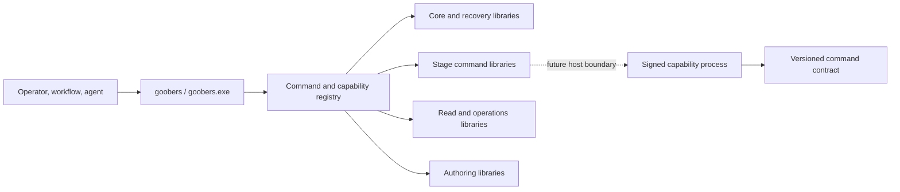

# Goobers componentization analysis

> **Status:** draft — incubator recommendation; implementation is activated
> only through individually approved issues.
> **Spec:** Architecture decision and staged implementation recommendation
> **Authors:** Jeff Steinbok, GitHub Copilot
> **Owner:** @jeffstei
> **Area:** architecture, command composition, CI, release engineering
> **Updated:** 2026-09-25

> **Recommendation:** make Goobers a layered set of explicit, independently
> testable Go libraries behind a thin `goobers` composition root, while
> continuing to ship one executable. Keep the package APIs host-neutral enough
> that selected libraries could later become signed external components, but
> treat the external host and wire contract as an optional follow-on decision,
> not a prerequisite for the refactor. Do not begin with Portal extraction or
> a general plugin runtime.

Supporting material:

- [component and resource inventory](goobers-componentization-inventory.md)
- [measurements and reproducible evidence](goobers-componentization-evidence.md)
- [standalone HTML sidecar](goobers-componentization-analysis.html)

## 1. Decision summary

Adopt one concrete architecture:

1. `cmd/goobers` becomes a thin composition root and public CLI adapter.
2. Built-in command families become importable libraries with explicit
   dependencies, owned schemas/descriptors, and package-local tests.
3. A common linked capability contract separates CLI metadata from
   implementation without requiring an IPC protocol.
4. The production release remains one statically linked executable initially.
5. If independent patching later proves valuable, selected libraries may gain
   an external host adapter and versioned wire contract without changing the
   public CLI or gaggles.

This addresses the immediate, measured problem first: test and command
concentration inside `cmd/goobers`. It also avoids foreclosing the desired
external-component model.

The primary value is not moving files or tests. That work is mechanical and
can be heavily automated. The value is creating boundaries that make behavior:

- easier to understand because ownership and dependencies are explicit;
- easier to test deeply with narrow deterministic fixtures;
- easier to debug because failures identify a capability rather than a giant
  package-main surface;
- more reliable because contracts and side effects can be checked in
  isolation;
- safer to change because package-local tests and dependency direction reduce
  unintended coupling;
- faster to validate locally and in CI because independent packages can run
  and cache separately.

Given automated refactoring and validation, this is worthwhile even if the
final deployable remains one executable. Improved CI speed is a useful outcome,
but improved coverage, reliability, diagnosability, and comprehensibility are
the stronger long-term return.

The current test shape does make unit testing harder than it needs to be.
Individual functions can be tested, but many command tests share package
`main`, package globals, CLI parsing, broad construction, embedded resources,
and a dependency closure spanning most of the product. That increases fixture
cost, makes effects harder to replace, and prevents Go's normal package-level
test scheduling from treating command families independently. The existing
three-way per-test split for `cmd/goobers` is a workaround for that structural
boundary.

Static linking is not the obstacle. Go compiles and caches packages
independently before linking the final executable, and the repository already
persists normal and race-mode build caches. Better package ownership allows
smaller tests to run independently and in parallel even though CI still links
one final `goobers` executable for composition and end-to-end validation.

The target is therefore **library first, external-capable by contract**:



## 2. Non-negotiable compatibility contract

The analysis treats the following as acceptance criteria, not preferences:

1. `goobers` / `goobers.exe` remains the entry point.
2. No existing CLI command, alias, flag, help text, output shape, result file,
   or exit code changes because a helper exists.
3. Existing gaggle YAML continues to use `command: [goobers, ...]`.
4. `GOOBERS_BIN` continues to point at the front executable.
5. Existing journals, schemas, feature compatibility, and workflow versions
   remain readable and executable.
6. A missing, corrupt, incompatible, or partially installed component cannot
   cause silent fallback to different semantics.
7. Offline init, validate, service repair, diagnostics, and rollback remain
   available.
8. Windows, Linux, and macOS remain supported; container and service entry
   points do not change.
9. The update supervisor retains one known-good rollback state.

## 3. Current-state findings

### 3.1 The source/test boundary is more monolithic than the package count suggests

The repository has 222 Go packages, but `cmd/goobers` directly imports 129
repository packages and contains:

- 402 production files;
- 644 test files;
- 4.57 MiB of production Go;
- 6.80 MiB of test Go;
- 3,520 recorded top-level tests;
- 1,520 seconds of race-mode timing weight.

CI already splits this one Go package into three test pieces because ordinary
package-level sharding cannot subdivide it. That is strong evidence that source
ownership must change before adding more runtime artifacts.

### 3.2 The executable is large because of code, not resources

The stripped binary measured:

- 101.31 MiB without the production Portal;
- 103.37 MiB with it.

All measured embedded payload classes total about 5.10 MiB raw, including the
2.32 MiB Portal build. Externalizing every resource would leave a large
executable and would trade one-file reliability for a modest size reduction.

### 3.3 Go packages already provide compile-time modularity

Package-local tests and the Go build cache can validate a changed package
without rebuilding unrelated code, but that benefit is diluted when:

- handlers and tests remain in package `main`;
- the composition root imports almost every subsystem directly;
- broad tests exercise private command functions rather than imported command
  packages;
- command metadata, help, and dispatch are tied to the package-main registry.

The first architectural action is not “create DLLs.” It is “make command
families real importable modules with narrow dependencies and contract tests.”

### 3.4 Unit testing is possible today, but unnecessarily expensive

The repository has substantial unit coverage, so the current design does not
prevent unit testing. The friction is architectural:

- command behavior, CLI adaptation, and construction frequently share package
  `main`;
- tests in one command family compile as part of the same package as hundreds
  of unrelated command files and tests;
- broad dependency construction makes isolated effects harder to substitute;
- package globals and embedded resources encourage larger fixtures;
- package-level CI cannot independently schedule command families;
- `-run` selects tests after compiling the entire package, so custom test
  splitting reduces execution time but not the package boundary.

The target libraries should use explicit constructor or function injection for
providers, journals, clocks, filesystems, process launchers, and other effects.
Prefer visible compile-time wiring over a reflective runtime DI container.

### 3.5 A safe future helper seam already exists

Deterministic workflow stages already use a subprocess-shaped protocol:

- `goobers` command-line argument vector (`argv`);
- scoped environment and credentials;
- config-generation pinning;
- result files and typed error files;
- stdout/stderr and exit status;
- journal-plane endpoint/token.

The main executable currently receives that invocation and runs the command
handler in its own process. Once handlers are real libraries behind a stable
contract, the composition root can either call the library directly or forward
the same command to an exact signed helper without changing the gaggle.

### 3.6 Update is currently an atomic binary transaction

Self-update stages one binary, smoke-checks it, retains the previous binary,
activates the candidate, observes heartbeats, and rolls back on failure.

Independent helpers or resources cannot be copied casually beside the binary.
They must become one versioned component-set transaction or the product can
enter mixed-version states that are less safe than the current monolith.

## 4. Concrete recommendation and tradeoffs

### 4.1 Build a layered library architecture now

Create four initial ownership layers:

| Layer | Responsibility |
| --- | --- |
| CLI contract | command descriptors, aliases, flags, help, output and exit-code metadata |
| Core libraries | startup, validation fallback, service, update, recovery, engine, runner, journal |
| Capability libraries | stage, provider, read/operations, and authoring command families |
| Composition root | construct dependencies, register capabilities, and dispatch through the public CLI |

Each capability library owns its implementation, tests, fixtures, and
capability-specific schemas or descriptors. Dependencies are passed explicitly.
Libraries must not import `cmd/goobers` or depend on package-main globals.

The release remains one statically linked executable. CI runs:

1. package-local unit tests for changed libraries;
2. dependent contract and integration tests;
3. one composition build and registry/schema parity suite;
4. focused end-to-end gaggle tests on pull requests;
5. the broad platform and workflow matrix on scheduled or release runs.

### 4.2 Preserve, but do not require, an external-component path

The CLI registry must resolve a command to a capability contract rather than a
package-main function. The default host calls the linked library. That linked
contract is part of the recommendation.

A wire contract and external process host are optional. Implement them only
when a named capability has demonstrated independent patch or fault-isolation
value. A well-factored library is a successful end state even if that decision
is never made.

This is intentionally not a general RPC system. Start with commands whose
existing contract is already process-shaped: argv, scoped environment, result
files, typed errors, stdout/stderr, exit status, cancellation, and journal
plane. Long-lived services remain in-process unless measured evidence supports
the lifecycle and IPC cost.

External components, if introduced, are installed only as immutable signed
sets with atomic activation and rollback. Native Go plugins, loose adjacent
files, `PATH` discovery, and per-file replacement are excluded.

### 4.3 Defer Portal externalization

Portal extraction was proposed for **patchability**, not size reduction. Its
existing `fs.FS` seam and separately packaged release archive make it a
reasonable future content-pack candidate, but it does not validate the more
important executable capability contract and adds packaging/security work
before the library boundary is proven.

Keep Portal embedded during the library refactor. Reconsider a verified Portal
override only after:

- an actual independent UI patch requirement is demonstrated;
- component-set signing and rollback already exist for an executable
  capability; or
- Portal release cadence materially differs from the core.

### 4.4 Accepted tradeoffs

**Benefits**

- stronger coverage through focused deterministic fixtures;
- higher reliability from isolated contracts and side-effect boundaries;
- easier debugging because failures map to an owning capability;
- better comprehensibility from explicit dependencies and smaller packages;
- materially smaller unit-test ownership and faster package-level scheduling;
- explicit dependencies and easier local fakes;
- continued one-file installation and current update reliability;
- a deliberate path to independently patchable capabilities;
- no public CLI or gaggle migration;
- no commitment to IPC for components that do not need it.

**Costs**

- automated movement still requires careful contract review and compatibility
  validation;
- dependency direction and contract ownership must be enforced;
- CI still links and smoke-tests the complete executable;
- independent patching is unavailable until a capability is actually hosted
  externally;
- any future external host adds serialization, signing, release, diagnostics,
  and rollback complexity;
- some shared Go dependencies will be duplicated across executable components.

The trade is intentional: automate the mechanical movement, but spend human
review on boundaries and observable behavior. The library architecture pays
for itself through coverage, reliability, debugging, comprehension, and
validation speed regardless of deployment topology. Pay runtime-component cost
only for demonstrated patchability or isolation value.

## 5. Recommended target architecture

### 5.1 Core executable responsibilities

The core should retain:

- public CLI parsing, registry, help, and dispatch;
- version/provenance and component diagnostics;
- minimal `init`, `validate`, `status`, diagnostics, service, update, and
  rollback paths;
- schemas and minimal recovery/first-run templates;
- config-generation fences and workflow compatibility checks;
- daemon supervisor, scheduler composition, runner/engine, and journal;
- a safe in-process implementation or explicit refusal for commands required
  to repair a broken component set.

Keeping the engine and journal in the core avoids versioning the most sensitive
durable semantics across a process boundary.

### 5.2 First external candidate: deterministic stage commands

If and when external hosting is justified, the first helper should own command
families that:

- are invoked by workflows as `goobers <command>`;
- already have provider-stage manifests or stable result-file contracts;
- do not need to remain available to repair component activation;
- have high change frequency or operational blocker value;
- can run as one-shot processes.

The front executable:

1. resolves the command through the existing registry;
2. decides in-process versus delegated implementation;
3. verifies the active component set;
4. launches the exact helper path with an internal handshake;
5. forwards stdio and termination;
6. returns the exact exit code;
7. records helper set ID and digest in diagnostics/provenance.

The gaggle sees no difference.

### 5.3 Portal is a deferred patchability option

Portal is not an extraction target for size reduction. It remains a credible
future patchability option because:

- the server already consumes `fs.FS`;
- `--dev-assets` proves directory-backed loading;
- release already builds a separate checksummed Portal archive;
- the executable can fall back to embedded assets.

Do not prioritize it ahead of the layered library work or the executable
capability contract. If later externalized, production behavior should be:

```text
valid compatible active Portal -> serve it
no active Portal               -> serve embedded Portal
invalid active Portal          -> fail closed for that set, report diagnostics,
                                  and serve the retained compatible fallback
```

“Fallback” means a previously verified set or embedded release-matched assets,
not arbitrary loose files.

## 6. Internal compatibility protocol

Every helper invocation should begin with a private contract that includes:

- protocol schema/version;
- core version and commit;
- active component-set ID;
- command name;
- command contract digest;
- schema/workflow compatibility identity;
- expected helper role and supported command registry digest.

The handshake can be a preflight command, inherited file descriptor/pipe, or
small invocation envelope. It must not change public stdout. A helper that
cannot prove compatibility fails before executing side effects.

Compatibility policy:

| Mismatch | Behavior |
| --- | --- |
| Missing optional content pack | Embedded fallback |
| Corrupt or unauthenticated active set | Reject set; use retained verified set/embedded fallback |
| Unsupported helper protocol | Do not launch helper |
| Command registry digest mismatch | Do not launch helper |
| Schema/workflow contract mismatch | Do not launch helper |
| Helper unavailable for non-critical delegated command | Explicit command failure with remediation; no silent semantic fallback |
| Helper unavailable for recovery-critical command | Use embedded core implementation |

Silent fallback for a mutating stage command is dangerous: the operator could
believe a hot patch is active while old semantics execute. Fallback eligibility
must be command metadata, not a catch-all behavior.

## 7. Trust and supply-chain model

### 7.1 Installation

- Component files live only under a product-managed root.
- A set directory is immutable after verification.
- Paths are manifest-relative and local.
- Helpers are regular files with expected executable permissions.
- Symlinks, junction/reparse escapes, and writable untrusted parents are
  rejected.
- Discovery never uses `PATH`, current directory, filename probing, or
  extension fallbacks.

### 7.2 Authenticity

SHA-256 detects corruption but does not authenticate a manifest obtained with
the payload. The design needs one authenticated root:

- platform-signed helpers plus a release-attested manifest;
- a signed manifest whose key is pinned/rotated by product policy;
- or a release provenance mechanism with equivalent guarantees.

The final choice should align with existing GitHub release, Authenticode, and
macOS signing/notarization operations. It should not create a weaker side
channel that can replace unsigned code beside a signed executable.

### 7.3 Activation

Activation is set-based:

1. download/stage complete set;
2. verify provenance, manifest, paths, size, and digests;
3. run helper `version`/contract probes and resource checks;
4. stop or drain affected long-lived consumers;
5. atomically replace `active.json`;
6. execute bounded health/conformance probes;
7. retain previous set until the health window passes;
8. restore the prior pointer on failure.

Never update an individual active file in place.

## 8. CI strategy

### 8.1 Source decomposition gate

Before any helper ships:

- package command handlers by coherent family;
- keep command metadata in one importable registry;
- move package-main tests with their handlers;
- enforce import direction so command packages do not import package `main`;
- run package-local tests on affected paths;
- retain whole-registry, generated-doc, and shipped-workflow gates.

Expected benefit: `cmd/goobers` stops being the indivisible test scheduling
unit. The existing custom per-test shard split becomes transitional rather than
the permanent architecture.

### 8.2 Dual-mode conformance

Every delegated command must run through the same fixture in two modes:

1. in-process handler;
2. front executable plus helper.

Compare:

- exit code;
- stdout/stderr bytes where stable;
- JSON/result-file content;
- typed error file;
- journal/artifact effects;
- provider requests;
- cancellation and timeout behavior;
- config-generation mismatch refusal.

Existing shipped-workflow tests should execute at least one full matrix against
the delegated topology without changing YAML.

### 8.3 Change-impact CI

Use Go dependency information and explicit ownership metadata to choose
additional jobs, but keep mandatory contract gates:

- CLI registry/help/man-page parity;
- schemas and workflow compatibility;
- release/update/component-set verification;
- shipped-workflow conformance;
- platform builds and signing layout;
- full scheduled/nightly suite.

Affected testing is an optimization, never permission to skip a declared
cross-component contract.

## 9. Migration sequence

### Phase 0: baseline and contract freeze

- Preserve the measurements in the evidence sidecar.
- Inventory command outputs, result files, aliases, and environment contracts.
- Add no runtime component behavior.

**Exit:** every candidate command has a machine-readable contract and a
conformance fixture.

### Phase 1: source/test decomposition

- Extract command registry metadata from package `main`.
- Move stage, read, authoring, and core handlers into importable families.
- Move tests with ownership.
- Keep all commands linked into one binary.

**Exit:** meaningful changes avoid compiling/testing unrelated command
families; shipped workflows remain byte/behavior compatible.

### Phase 2: linked capability contract

- Separate command descriptors from implementation functions.
- Define the linked invocation and conformance contract.
- Keep package APIs free of package-main state and transport assumptions.
- Keep production dispatch linked.

**Exit:** extracted command libraries share a common contract without changing
CLI or gaggle behavior.

### Optional Phase 3: external-host proof

- Select one capability with demonstrated patch or fault-isolation value.
- Define a versioned wire contract and test-only subprocess host.
- Run the same conformance fixture through linked and subprocess hosts.

**Exit:** the external host proves value and behavioral parity. If it does not,
stop with the layered linked architecture.

### Optional Phase 4: production component set

- Define signed manifest and compatibility schemas.
- Implement safe staging, verification, atomic activation, retention, and
  diagnostics.
- Integrate the transaction with self-update/supervision.
- Ship the proven one-shot helper.

**Exit:** existing gaggles run unchanged; helper failure is isolated; update and
rollback are atomic; CI shows measured improvement.

### Optional Phase 5: selective expansion

Candidate expansion order:

1. other deterministic stage families;
2. Portal, agent toolkit, and extension assets when independent patch demand
   is demonstrated;
3. optional authoring helper with embedded validation fallback;
4. long-lived read worker only if measured need exists.

Engine/runner/journal extraction is not an assumed destination.

## 10. Pros and cons of the recommendation

### Pros

- Preserves the product's strongest operational property: one stable command.
- Delivers CI and local-test improvement before deployment complexity.
- Makes dependencies explicit and lets command packages own focused fixtures.
- Enables narrowly scoped hot patches for the commands most likely to block a
  running gaggle.
- Uses process isolation instead of an unsupported/fragile in-process ABI.
- Treats resources according to risk rather than ideology.
- Reuses existing subprocess, `fs.FS`, release archive, atomic write, health,
  and rollback seams.
- Supports Windows without a separate architecture.

### Cons

- Moving command implementations and tests out of package `main` is a
  substantial migration.
- CI still builds the whole executable for composition and end-to-end gates.
- Multi-binary releases and component manifests increase release engineering
  if external hosting is adopted.
- Aggregate installation size can grow because Go dependencies are duplicated.
- Signing and notarization must cover every executable.
- The component-set verifier becomes security-critical.
- Dual implementations during migration increase test cost temporarily.
- Fine-grained patches remain constrained by compatibility-set granularity.

## 11. Rejected shortcuts

### Loose files next to `goobers.exe`

Rejected. Adjacent mutable files invite partial updates, loader/path confusion,
tampering, and support ambiguity. External files require an immutable verified
set and explicit activation.

### Search `PATH` for helpers

Rejected. It makes behavior depend on ambient installation order and creates a
binary-preloading risk.

### Replace one helper file in place

Rejected. The core and helper may observe different versions across concurrent
commands, and rollback cannot reconstruct a known compatible set.

### Externalize all schemas/templates

Rejected. The size saving is small and it weakens offline validation,
first-run, and recovery guarantees.

### Split the daemon/engine first

Rejected. Their dependency closures and durable semantics are broad; the
resulting protocol would be larger and riskier than the stage-command seam.

### Use Go plugins

Rejected for Windows, race-detector, build-identity, unload, and crash-isolation
reasons.

## 12. Decision gates before implementation

The layered library refactor can begin after command contracts and baseline
tests are captured. External component implementation should not begin until
owners decide:

1. What authenticated provenance mechanism signs component manifests?
2. Which first executable capability has enough patch value to justify an
   external host?
3. Which commands are explicitly recovery-critical and never delegation-only?
4. Is hot patch distribution tied only to full releases, or can a core version
   authorize later component-set revisions?
5. What compatibility window may a helper declare against core versions?
6. Where is the component root for portable installs, supervised instances,
   Windows services, and containers?
7. What disk-retention policy keeps previous sets without unbounded growth?
8. What measured condition would justify Portal externalization?

## 13. Final recommendation

Adopt the layered-library-first architecture, with this order:

1. **Turn built-ins into explicit, independently tested Go libraries.**
2. **Make `cmd/goobers` a thin composition root and stable CLI adapter.**
3. **Define a linked capability contract without committing to IPC.**
4. **Stop here unless a named capability demonstrates independent patch or
   fault-isolation value.**
5. **If justified, prove one command through linked and external hosts.**
6. **Add signed atomic component sets when enabling the first external
   executable.**
7. **Externalize Portal or other content only for demonstrated patch value.**

This path directly addresses the observed `cmd/goobers` CI bottleneck and
improves local unit testing immediately. It also creates a safe hot-patch route
without committing the entire product to IPC or asking existing gaggles to
understand the deployment topology.
