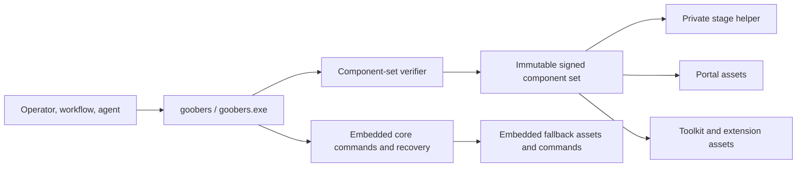

# Goobers componentization analysis

**Status:** draft — decision package; no implementation authorized.

> **Recommendation:** do not replace the single executable with dynamically
> loaded libraries. First decompose `cmd/goobers` into independently owned and
> tested command packages while retaining one binary. Then introduce one
> versioned, signed **component set** mechanism, initially for Portal/content
> assets and later for a private deterministic-stage helper executable.
> `goobers` remains the only public entry point and retains validation,
> startup, update, recovery, and fallback capabilities.

Supporting material:

- [component and resource inventory](goobers-componentization-inventory.md)
- [measurements and reproducible evidence](goobers-componentization-evidence.md)
- [standalone HTML sidecar](goobers-componentization-analysis.html)

## 1. Decision summary

The problem contains three related but independent goals:

1. **Faster CI:** smaller source and test ownership boundaries.
2. **Safer hot patches:** independently replaceable runtime capabilities.
3. **Less embedding:** release assets that may safely live outside the binary.

One mechanism does not solve all three.

- Splitting the executable without moving tests out of `cmd/goobers` would not
  fix the current CI long pole.
- Moving tests into packages can materially improve CI while still shipping
  one executable.
- External files do not materially shrink the 103 MiB binary: all measured
  embedded payloads are about 5.10 MiB raw, and the Portal changes the linked
  binary by only 2.06 MiB.
- Runtime splitting is justified by patch isolation and failure containment,
  not by executable size.

The recommended destination is therefore a **phased hybrid**, not a universal
plugin architecture:



## 2. Non-negotiable compatibility contract

The analysis treats the following as acceptance criteria, not preferences:

1. `goobers` / `goobers.exe` remains the entry point.
2. No existing CLI command, alias, flag, help text, output shape, result file,
   or exit code changes because a helper exists.
3. Existing gaggle YAML continues to use `command: [goobers, ...]`.
4. `GOOBERS_BIN` continues to point at the front executable.
5. Existing journals, schemas, feature compatibility, and workflow versions
   remain readable and executable.
6. A missing, corrupt, incompatible, or partially installed component cannot
   cause silent fallback to different semantics.
7. Offline init, validate, service repair, diagnostics, and rollback remain
   available.
8. Windows, Linux, and macOS remain supported; container and service entry
   points do not change.
9. The update supervisor retains one known-good rollback state.

## 3. Current-state findings

### 3.1 The source/test boundary is more monolithic than the package count suggests

The repository has 222 Go packages, but `cmd/goobers` directly imports 129
repository packages and contains:

- 402 production files;
- 644 test files;
- 4.57 MiB of production Go;
- 6.80 MiB of test Go;
- 3,520 recorded top-level tests;
- 1,520 seconds of race-mode timing weight.

CI already splits this one Go package into three test pieces because ordinary
package-level sharding cannot subdivide it. That is strong evidence that source
ownership must change before adding more runtime artifacts.

### 3.2 The executable is large because of code, not resources

The stripped binary measured:

- 101.31 MiB without the production Portal;
- 103.37 MiB with it.

All measured embedded payload classes total about 5.10 MiB raw, including the
2.32 MiB Portal build. Externalizing every resource would leave a large
executable and would trade one-file reliability for a modest size reduction.

### 3.3 Go packages already provide compile-time modularity

Package-local tests and the Go build cache can validate a changed package
without rebuilding unrelated code, but that benefit is diluted when:

- handlers and tests remain in package `main`;
- the composition root imports almost every subsystem directly;
- broad tests exercise private command functions rather than imported command
  packages;
- command metadata, help, and dispatch are tied to the package-main registry.

The first architectural action is not “create DLLs.” It is “make command
families real importable modules with narrow dependencies and contract tests.”

### 3.4 A safe helper seam already exists

Deterministic workflow stages already use a subprocess-shaped protocol:

- `goobers` argv;
- scoped environment and credentials;
- config-generation pinning;
- result files and typed error files;
- stdout/stderr and exit status;
- journal-plane endpoint/token.

The main executable currently receives that invocation and runs the command
handler in its own process. It can instead classify selected commands and
forward them to an exact sibling helper without changing the gaggle.

### 3.5 Update is currently an atomic binary transaction

Self-update stages one binary, smoke-checks it, retains the previous binary,
activates the candidate, observes heartbeats, and rolls back on failure.

Independent helpers or resources cannot be copied casually beside the binary.
They must become one versioned component-set transaction or the product can
enter mixed-version states that are less safe than the current monolith.

## 4. Options

Scores use 1 (poor) through 5 (strong). Weighted total is out of 5.

| Criterion | Weight |
| --- | ---: |
| CI and independent validation | 25% |
| Hot-patch capability | 20% |
| CLI/gaggle compatibility | 20% |
| Cross-platform support | 10% |
| Operational simplicity | 10% |
| Security/trust posture | 10% |
| Rollback quality | 5% |

| Option | CI | Patch | Compat | Platform | Ops | Security | Rollback | Weighted |
| --- | ---: | ---: | ---: | ---: | ---: | ---: | ---: | ---: |
| A. One binary, source/test decomposition | 5 | 1 | 5 | 5 | 5 | 5 | 5 | **4.20** |
| B. Private helper executables | 4 | 4 | 4 | 5 | 3 | 4 | 4 | **4.00** |
| C. Long-lived local RPC components | 3 | 5 | 3 | 4 | 2 | 3 | 4 | **3.45** |
| D. Signed versioned component sets | 4 | 5 | 4 | 5 | 3 | 4 | 5 | **4.25** |
| E. Go plugins/shared-library loading | 3 | 4 | 2 | 1 | 2 | 1 | 2 | **2.45** |
| F. Phased hybrid: A, then D+B selectively | 5 | 5 | 5 | 5 | 3 | 4 | 5 | **4.70** |

The scores are directional, not a substitute for benchmarks. Their purpose is
to make the tradeoff explicit.

### 4.1 Option A: one binary, source/test decomposition

**Shape**

- Keep current release and runtime packaging.
- Move command handlers and tests from `cmd/goobers` into importable packages.
- Keep one registry and thin dispatch adapters in package `main`.
- Add affected-package CI planning and narrower test binaries.

**Pros**

- Highest immediate CI value with the least operational risk.
- Preserves one-file install, signing, service, container, and update behavior.
- Improves maintainability even if runtime splitting is never adopted.
- Makes later helper boundaries mechanical rather than a second rewrite.
- Retains Go's build-cache and type-safety strengths.

**Cons**

- Cannot hot-patch a capability independently.
- A release still replaces the full binary.
- A core startup/link failure still affects every command.

**Decision**

Proceed as prerequisite work for any other option.

### 4.2 Option B: private helper executables

**Shape**

`goobers` owns public parsing/dispatch and invokes exact component-set helpers
for selected commands. Helpers are not placed on `PATH` and are not public CLI
entry points.

**Pros**

- Portable across all supported Go platforms.
- Independent process crash/memory boundary.
- Helpers can be individually built, tested, signed, staged, and rolled back.
- Existing stage argv/env/result-file protocol minimizes new translation.
- Core can preserve exit codes and stream stdout/stderr.

**Cons**

- Shared Go dependencies are duplicated across binaries.
- Aggregate download/container size will usually grow.
- Signal forwarding, cancellation, stdio, environment, and error behavior need
  exact conformance tests.
- Helper discovery and activation create a new supply-chain boundary.
- Moving a function across a process requires explicit serialization.

**Decision**

Use selectively after Option A. The first candidate is deterministic built-in
stage commands, not the daemon or workflow engine.

### 4.3 Option C: long-lived local RPC components

**Shape**

The front or supervisor starts resident workers and calls them over a named
pipe, Unix-domain socket, loopback RPC, or existing HTTP/gRPC substrate.

**Pros**

- Fine-grained independent restart and patching.
- Avoids per-command process startup.
- Can isolate memory, crashes, and dependency sets.
- Supports richer typed protocols than environment/result files.

**Cons**

- Adds authentication, socket/pipe permissions, lifecycle, draining, health,
  version negotiation, cancellation, and log correlation.
- Creates new states during service startup and update.
- Long-lived mixed-version behavior is harder than one-shot helper delegation.
- Local RPC can become an accidentally public attack surface.
- More difficult to preserve exact CLI streaming behavior.

**Decision**

Defer. Reconsider only for components that are already long-lived and show
measured reliability or scale benefit, such as a future read-service worker.

### 4.4 Option D: signed versioned component sets

**Shape**

Helpers and external assets are installed in immutable version directories
described by a signed/hash-pinned manifest. One atomic pointer selects the
active compatible set; the prior set is retained.

**Pros**

- Prevents mixed helper/resource versions.
- Generalizes current binary staging and rollback.
- Supports both executable and content hot patches.
- Gives diagnostics one set ID and provenance record.
- Enables pre-activation verification and smoke checks.

**Cons**

- Requires a manifest schema, signing/provenance policy, secure path handling,
  retention, garbage collection, and activation state machine.
- Platform signing becomes multi-file: every helper needs Authenticode or
  codesigning/notarization treatment.
- A checksum manifest is not enough unless its provenance is authenticated.
- More complex than replacing one file.

**Decision**

Adopt as the only deploy-time extension mechanism. Do not introduce separate
ad hoc search paths for Portal, toolkit, or helpers.

### 4.5 Option E: Go plugins or native dynamically loaded libraries

**Pros**

- In-process calls and shared Go types.
- Potentially small call overhead.
- Can defer loading optional code.

**Cons**

- Go plugins do not support Windows.
- They are poorly supported by the race detector.
- They require effectively identical toolchain, tags, flags, environment, and
  common dependency sources.
- A plugin cannot be unloaded.
- A plugin crash or memory corruption crashes the core.
- The standard library warns that IPC is often more suitable.
- Native-library approaches add cgo/ABI, signing, loader search, and
  cross-platform complexity to a currently pure-Go release.

**Decision**

Do not pursue.

### 4.6 Option F: phased hybrid

**Shape**

1. Decompose source/tests while retaining one executable.
2. Add component-set verification/activation with an external Portal trial.
3. Extract selected stage-command families to a one-shot helper.
4. Keep core validation, daemon, engine, journal, update, and recovery embedded.

**Pros**

- Captures CI benefit before accepting deployment complexity.
- Uses one security/update mechanism for every external artifact.
- Starts with reversible, low-risk resources.
- Moves the most naturally subprocess-oriented code first.
- Preserves an embedded recovery path.

**Cons**

- During migration, both in-process and delegated forms need conformance tests.
- The release remains multi-artifact after helper adoption.
- Some binary duplication is intentional.

**Decision**

Recommended.

## 5. Recommended target architecture

### 5.1 Core executable responsibilities

The core should retain:

- public CLI parsing, registry, help, and dispatch;
- version/provenance and component diagnostics;
- component-set verification and activation;
- minimal `init`, `validate`, `status`, diagnostics, service, update, and
  rollback paths;
- schemas and minimal recovery/first-run templates;
- config-generation fences and workflow compatibility checks;
- daemon supervisor, scheduler composition, runner/engine, and journal;
- a safe in-process implementation or explicit refusal for commands required
  to repair a broken component set.

Keeping the engine and journal in the core avoids versioning the most sensitive
durable semantics across a process boundary.

### 5.2 First helper: deterministic stage commands

The helper should initially own command families that:

- are invoked by workflows as `goobers <command>`;
- already have provider-stage manifests or stable result-file contracts;
- do not need to remain available to repair component activation;
- have high change frequency or operational blocker value;
- can run as one-shot processes.

The front executable:

1. resolves the command through the existing registry;
2. decides in-process versus delegated implementation;
3. verifies the active component set;
4. launches the exact helper path with an internal handshake;
5. forwards stdio and termination;
6. returns the exact exit code;
7. records helper set ID and digest in diagnostics/provenance.

The gaggle sees no difference.

### 5.3 First resource override: Portal

Portal is the best mechanism trial because:

- the server already consumes `fs.FS`;
- `--dev-assets` proves directory-backed loading;
- release already builds a separate checksummed Portal archive;
- a content mismatch is easy to detect;
- the executable can fall back to embedded assets.

The production behavior should be:

```text
valid compatible active Portal -> serve it
no active Portal               -> serve embedded Portal
invalid active Portal          -> fail closed for that set, report diagnostics,
                                  and serve the retained compatible fallback
```

“Fallback” means a previously verified set or embedded release-matched assets,
not arbitrary loose files.

## 6. Internal compatibility protocol

Every helper invocation should begin with a private contract that includes:

- protocol schema/version;
- core version and commit;
- active component-set ID;
- command name;
- command contract digest;
- schema/workflow compatibility identity;
- expected helper role and supported command registry digest.

The handshake can be a preflight command, inherited file descriptor/pipe, or
small invocation envelope. It must not change public stdout. A helper that
cannot prove compatibility fails before executing side effects.

Compatibility policy:

| Mismatch | Behavior |
| --- | --- |
| Missing optional content pack | Embedded fallback |
| Corrupt or unauthenticated active set | Reject set; use retained verified set/embedded fallback |
| Unsupported helper protocol | Do not launch helper |
| Command registry digest mismatch | Do not launch helper |
| Schema/workflow contract mismatch | Do not launch helper |
| Helper unavailable for non-critical delegated command | Explicit command failure with remediation; no silent semantic fallback |
| Helper unavailable for recovery-critical command | Use embedded core implementation |

Silent fallback for a mutating stage command is dangerous: the operator could
believe a hot patch is active while old semantics execute. Fallback eligibility
must be command metadata, not a catch-all behavior.

## 7. Trust and supply-chain model

### 7.1 Installation

- Component files live only under a product-managed root.
- A set directory is immutable after verification.
- Paths are manifest-relative and local.
- Helpers are regular files with expected executable permissions.
- Symlinks, junction/reparse escapes, and writable untrusted parents are
  rejected.
- Discovery never uses `PATH`, current directory, filename probing, or
  extension fallbacks.

### 7.2 Authenticity

SHA-256 detects corruption but does not authenticate a manifest obtained with
the payload. The design needs one authenticated root:

- platform-signed helpers plus a release-attested manifest;
- a signed manifest whose key is pinned/rotated by product policy;
- or a release provenance mechanism with equivalent guarantees.

The final choice should align with existing GitHub release, Authenticode, and
macOS signing/notarization operations. It should not create a weaker side
channel that can replace unsigned code beside a signed executable.

### 7.3 Activation

Activation is set-based:

1. download/stage complete set;
2. verify provenance, manifest, paths, size, and digests;
3. run helper `version`/contract probes and resource checks;
4. stop or drain affected long-lived consumers;
5. atomically replace `active.json`;
6. execute bounded health/conformance probes;
7. retain previous set until the health window passes;
8. restore the prior pointer on failure.

Never update an individual active file in place.

## 8. CI strategy

### 8.1 Source decomposition gate

Before any helper ships:

- package command handlers by coherent family;
- keep command metadata in one importable registry;
- move package-main tests with their handlers;
- enforce import direction so command packages do not import package `main`;
- run package-local tests on affected paths;
- retain whole-registry, generated-doc, and shipped-workflow gates.

Expected benefit: `cmd/goobers` stops being the indivisible test scheduling
unit. The existing custom per-test shard split becomes transitional rather than
the permanent architecture.

### 8.2 Dual-mode conformance

Every delegated command must run through the same fixture in two modes:

1. in-process handler;
2. front executable plus helper.

Compare:

- exit code;
- stdout/stderr bytes where stable;
- JSON/result-file content;
- typed error file;
- journal/artifact effects;
- provider requests;
- cancellation and timeout behavior;
- config-generation mismatch refusal.

Existing shipped-workflow tests should execute at least one full matrix against
the delegated topology without changing YAML.

### 8.3 Change-impact CI

Use Go dependency information and explicit ownership metadata to choose
additional jobs, but keep mandatory contract gates:

- CLI registry/help/man-page parity;
- schemas and workflow compatibility;
- release/update/component-set verification;
- shipped-workflow conformance;
- platform builds and signing layout;
- full scheduled/nightly suite.

Affected testing is an optimization, never permission to skip a declared
cross-component contract.

## 9. Migration sequence

### Phase 0: baseline and contract freeze

- Preserve the measurements in the evidence sidecar.
- Inventory command outputs, result files, aliases, and environment contracts.
- Add no runtime component behavior.

**Exit:** every candidate command has a machine-readable contract and a
conformance fixture.

### Phase 1: source/test decomposition

- Extract command registry metadata from package `main`.
- Move stage, read, authoring, and core handlers into importable families.
- Move tests with ownership.
- Keep all commands linked into one binary.

**Exit:** meaningful changes avoid compiling/testing unrelated command
families; shipped workflows remain byte/behavior compatible.

### Phase 2: component-set foundation

- Define manifest and compatibility schemas.
- Implement safe staging, verification, atomic activation, retention, and
  diagnostics.
- Integrate the transaction with self-update/supervision.
- Do not load executable helpers yet.

**Exit:** crash/restart and malicious-filesystem tests prove no partial active
set and reliable rollback.

### Phase 3: external Portal trial

- Package Portal in the component set.
- Prefer compatible verified Portal assets.
- Retain embedded fallback.
- Measure support and patch workflow.

**Exit:** Portal can be upgraded and rolled back independently without CLI,
daemon API, offline, or recovery regressions.

### Phase 4: deterministic stage helper

- Build and sign a one-shot helper.
- Delegate a small non-recovery command family.
- Run dual-mode and shipped-workflow conformance.
- Expand only after observed reliability.

**Exit:** existing gaggles run unchanged; helper failure is isolated; update and
rollback are atomic; CI shows measured improvement.

### Phase 5: selective expansion

Candidate expansion order:

1. other deterministic stage families;
2. agent toolkit and Portal extension assets;
3. optional authoring helper with embedded validation fallback;
4. long-lived read worker only if measured need exists.

Engine/runner/journal extraction is not an assumed destination.

## 10. Pros and cons of the recommendation

### Pros

- Preserves the product's strongest operational property: one stable command.
- Delivers CI improvement before deployment complexity.
- Enables narrowly scoped hot patches for the commands most likely to block a
  running gaggle.
- Uses process isolation instead of an unsupported/fragile in-process ABI.
- Treats resources according to risk rather than ideology.
- Reuses existing subprocess, `fs.FS`, release archive, atomic write, health,
  and rollback seams.
- Supports Windows without a separate architecture.

### Cons

- Multi-binary releases and component manifests increase release engineering.
- Aggregate installation size can grow because Go dependencies are duplicated.
- Signing and notarization must cover every executable.
- The component-set verifier becomes security-critical.
- Dual implementations during migration increase test cost temporarily.
- Fine-grained patches remain constrained by compatibility-set granularity.

## 11. Rejected shortcuts

### Loose files next to `goobers.exe`

Rejected. Adjacent mutable files invite partial updates, loader/path confusion,
tampering, and support ambiguity. External files require an immutable verified
set and explicit activation.

### Search `PATH` for helpers

Rejected. It makes behavior depend on ambient installation order and creates a
binary-preloading risk.

### Replace one helper file in place

Rejected. The core and helper may observe different versions across concurrent
commands, and rollback cannot reconstruct a known compatible set.

### Externalize all schemas/templates

Rejected. The size saving is small and it weakens offline validation,
first-run, and recovery guarantees.

### Split the daemon/engine first

Rejected. Their dependency closures and durable semantics are broad; the
resulting protocol would be larger and riskier than the stage-command seam.

### Use Go plugins

Rejected for Windows, race-detector, build-identity, unload, and crash-isolation
reasons.

## 12. Decision gates before implementation

Implementation should not begin until owners decide:

1. What authenticated provenance mechanism signs component manifests?
2. Is an embedded full Portal retained, or a smaller recovery Portal?
3. Which commands are explicitly recovery-critical and never delegation-only?
4. Is hot patch distribution tied only to full releases, or can a core version
   authorize later component-set revisions?
5. What compatibility window may a helper declare against core versions?
6. Where is the component root for portable installs, supervised instances,
   Windows services, and containers?
7. What disk-retention policy keeps previous sets without unbounded growth?
8. Which first stage-command family has enough operational patch value and a
   narrow enough dependency closure to justify extraction?

## 13. Final recommendation

Adopt the phased hybrid, with this order:

1. **Decompose source and tests first.**
2. **Create one signed, atomic component-set mechanism.**
3. **Trial it with Portal assets and embedded fallback.**
4. **Extract deterministic stage commands into a private one-shot helper.**
5. **Expand only where measurements justify a runtime boundary.**

This path directly addresses the observed `cmd/goobers` CI bottleneck and
creates a safe hot-patch route without changing the public CLI or asking
existing gaggles to understand the deployment topology.
