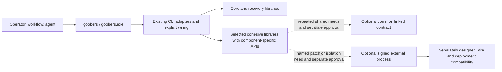

# Goobers componentization analysis

> **Status:** draft — incubator recommendation; implementation is activated
> only through individually approved issues.
> **Spec:** Architecture decision and staged implementation recommendation
> **Authors:** Jeff Steinbok, GitHub Copilot
> **Owner:** @jeffstei
> **Area:** architecture, command composition, CI, release engineering
> **Updated:** 2026-09-28

> **Recommendation:** make Goobers a layered set of explicit, independently
> testable Go libraries behind a thin `goobers` composition root, while
> continuing to ship one executable. Proceed incrementally through measured,
> individually approved boundaries, not a wholesale component framework.
> Use explicit component-specific Go APIs; common contracts and external hosting
> require separate justification. Do not begin with Portal extraction or a
> general plugin runtime.

Supporting material:

- [component and resource inventory](goobers-componentization-inventory.md)
- [measurements and reproducible evidence](goobers-componentization-evidence.md)
- [docs-churn experiment](../experiments/docs-churn-extraction.md)
- [contention and PR-status experiments](../experiments/provider-component-extraction.md)
- [standalone HTML sidecar](goobers-componentization-analysis.html)

## 1. Decision summary

Keep the library-first, single-executable direction, with evidence gates:

1. `cmd/goobers` becomes a thin composition root and public CLI adapter.
2. Extract cohesive behavior used by real consumers into importable libraries
   with explicit dependencies and package-local tests, not one package per command.
3. Use ordinary component-specific Go APIs. Extract shared registry metadata or
   a common linked contract only after repeated shared needs demonstrate its value.
4. The production release remains one statically linked executable.
5. Consider an external host and wire contract only through a separate approval
   for a named independent-patch or fault-isolation need, preserving the CLI and YAML.

Three bounded pilots demonstrate substantially lower focused-test overhead while
retaining tested command behavior (section 3.7). They validate an extraction
technique, not completion of broad source decomposition, a universal architecture,
or a common hosting protocol. Their implementation is experimental, not approved
production code and not merged into this incubator recommendation or upstream.

Reliability, easier debugging, comprehensibility, maintainability, and CI savings
remain hypotheses to evaluate. Package count and lines moved are not success
metrics. API, navigation, and fixture costs can outweigh a smaller test boundary.
Automation can move code, but it does not establish that a boundary is useful.

Existing unit tests, pure helpers, and narrow provider fakes already work.
New failure-path assertions could be added without extraction. The observed
advantage is running focused tests without loading, linking, and initializing
the entire command test package. Many command tests still share package `main`,
globals, CLI parsing, broad construction, and embedded resources; the existing
three-way per-test split remains useful and is not retired by these pilots.

Static linking is not the obstacle. Go compiles and caches packages
independently before linking the final executable, and the repository already
persists normal and race-mode build caches. Better package ownership allows
smaller tests to run independently and in parallel even though CI still links
one final `goobers` executable for composition and end-to-end validation.

The target is therefore **library first, evidence-gated, one executable**:



## 2. Non-negotiable compatibility contract

The analysis treats the following as acceptance criteria, not preferences:

1. `goobers` / `goobers.exe` remains the entry point.
2. No existing CLI command, alias, flag, help text, output shape, result file,
   or exit code changes because a helper exists.
3. Existing gaggle YAML continues to use `command: [goobers, ...]`.
4. `GOOBERS_BIN` continues to point at the front executable.
5. Existing journals, schemas, feature compatibility, and workflow versions
   remain readable and executable.
6. A missing, corrupt, incompatible, or partially installed component cannot
   cause silent fallback to different semantics.
7. Offline init, validate, service repair, diagnostics, and rollback remain
   available.
8. Windows, Linux, and macOS remain supported; container and service entry
   points do not change.
9. The update supervisor retains one known-good rollback state.

This source refactor changes neither dispatcher version-skew checks nor
upgrade/draining behavior, the binary deployment unit, or cloud rolling-upgrade
guarantees. Independently deployed components would require a separate deployment
compatibility design; extracting a Go package supplies none of those guarantees.

## 3. Current-state findings

### 3.1 The source/test boundary is more monolithic than the package count suggests

The repository has 222 Go packages, but `cmd/goobers` directly imports 129
repository packages and contains:

- 402 production files;
- 644 test files;
- 4.57 MiB of production Go;
- 6.80 MiB of test Go;
- 3,520 recorded top-level tests;
- 1,520 seconds of race-mode timing weight.

These are the dated 2026-09-25 baseline measurements, not a refreshed inventory.
CI already splits this one Go package into three test pieces because ordinary
package-level sharding cannot subdivide it. That motivates testing smaller source
boundaries before adding runtime artifacts; it does not prove broad migration pays.

### 3.2 The executable is large because of code, not resources

The stripped binary measured:

- 101.31 MiB without the production Portal;
- 103.37 MiB with it.

All measured embedded payload classes total about 5.10 MiB raw, including the
2.32 MiB Portal build. Externalizing every resource would leave a large
executable and would trade one-file reliability for a modest size reduction.

### 3.3 Go packages already provide compile-time modularity

Package-local tests and the Go build cache can validate a changed package
without rebuilding unrelated code, but that benefit is diluted when:

- handlers and tests remain in package `main`;
- the composition root imports almost every subsystem directly;
- broad tests exercise private command functions rather than imported command
  packages;
- command metadata, help, and dispatch are tied to the package-main registry.

The next architectural action is not “create DLLs.” It is to review the measured
boundaries and select one more representative component with narrow dependencies
and retained contract tests.

### 3.4 Unit testing is possible today, but unnecessarily expensive

The repository has substantial unit coverage, so the current design does not
prevent unit testing. The friction is architectural:

- command behavior, CLI adaptation, and construction frequently share package
  `main`;
- tests in one command family compile as part of the same package as hundreds
  of unrelated command files and tests;
- broad dependency construction makes isolated effects harder to substitute;
- package globals and embedded resources encourage larger fixtures;
- package-level CI cannot independently schedule command families;
- `-run` selects tests after compiling the entire package, so custom test
  splitting reduces execution time but not the package boundary.

Use explicit constructor or function inputs where they help the selected
behavior. Reuse existing narrow provider interfaces. Inject clocks or process
dependencies when useful; real temporary files are acceptable. Do not impose
blanket filesystem/effects abstractions or a reflective runtime DI container.

### 3.5 A safe future helper seam already exists

Deterministic workflow stages already use a subprocess-shaped protocol:

- `goobers` command-line argument vector (`argv`);
- scoped environment and credentials;
- config-generation pinning;
- result files and typed error files;
- stdout/stderr and exit status;
- journal-plane endpoint/token.

The main executable currently receives that invocation and runs the command
handler in its own process. This is prior art for a separately approved host
adapter, not a requirement that every library adopt a universal invocation
envelope or transport-neutral API.

### 3.6 Update is currently an atomic binary transaction

Self-update stages one binary, smoke-checks it, retains the previous binary,
activates the candidate, observes heartbeats, and rolls back on failure.

Independent helpers or resources cannot be copied casually beside the binary.
They must become one versioned component-set transaction or the product can
enter mixed-version states that are less safe than the current monolith.

### 3.7 Bounded extraction evidence (2026-09-28)

The frozen [docs-churn report](../experiments/docs-churn-extraction.md) and
[provider-component report](../experiments/provider-component-extraction.md)
include methodology and limitations; their linked JSON artifacts retain raw
samples. Only reports are included here, not experiment implementation or
measurement scripts. Reproduction requires the experiment checkout and its
recorded baseline, not this documentation-only branch.

| Pilot | Own command baseline | Production dependency packages, baseline -> library | Warm no-selected-tests median, baseline -> library |
| --- | --- | ---: | ---: |
| docs-churn | `1b0655b3` | 1,178 -> 84 (92.9% fewer) | 11.388 -> 3.081 s (72.9% lower) |
| Contention query/ranking | `3a1de891` | 1,179 -> 425 (64.0% fewer) | 13.859 -> 3.303 s (76.2% lower) |
| PR-status | `3a1de891` | 1,179 -> 425 (64.0% fewer) | 13.859 -> 4.633 s (66.6% lower) |

Overhead uses `go test -count=1 -run '^$'`: it includes Go startup,
loading/build/linking, test-process startup, and `TestMain`, not whole-suite
runtime or pure compilation. Each experiment has its own baseline. Complete
library suites and retained CLI scenarios are different workloads, not identical
tests to compare as a speedup. Whole-command timings overlap and are basically
unchanged; the command gains one dependency in the first pilot and two in the
follow-up. All three complete library suites and targeted CLI tests passed
`-race` after GCC installation, resolving the first report's tooling blocker.

Docs-churn retained its original eight CLI tests and separately demonstrated
eight-case executable before/after parity for exit status, stdout/stderr, results,
and watermark state. Contention and PR-status have in-process consumer/provider
regression checks, not executable parity. A deliberate docs-churn time-buffer
multiplication-to-division mutation survived the original eight CLI tests but
failed the new overlap test. That is a useful assertion, not an exclusive
capability of packages: the test could also have been added in package `main`.

Core production source grew by 51 lines in the first pilot and 20 in the
follow-up (the latter excludes small caller import/type-name changes). Additional
API and navigation boundaries are real costs. Contention is the strongest
architectural example because backlog selection and implementation-context share
the behavior; PR-status's architectural value is modest despite its measured
isolated-test benefit. None requires a common registry or hosting contract.

These are three warm samples per measurement on a shared Windows machine.
The first baseline was on C: and the experiment on Q:; the follow-up used the
same Q: drive for both. Private build caches do not control module/OS caches,
disk, antivirus, or other activity. No full CI critical-path/runner-cost gain,
production reliability or incident reduction, fleet-wide benefit, platform
matrix, or independently patchable deployment has been proven. The pilots are
small; review them, then measure a more-coupled representative component before
authorizing broader migration.

## 4. Concrete recommendation and tradeoffs

### 4.1 Evaluate a layered library architecture incrementally

Use these ownership responsibilities to evaluate boundaries, not as a mandatory
package taxonomy or blanket migration approval:

| Layer | Responsibility |
| --- | --- |
| CLI contract | command descriptors, aliases, flags, help, output and exit-code metadata |
| Core libraries | startup, validation fallback, service, update, recovery, engine, runner, journal |
| Selected behavior libraries | cohesive stage, provider, read/operations, or authoring behavior used by real consumers |
| Composition root | construct dependencies and dispatch through existing public CLI adapters |

Each selected library owns its implementation, tests, fixtures, and any
behavior-specific schemas or descriptors it actually needs. Dependencies are explicit.
Libraries must not import `cmd/goobers` or depend on package-main globals.

The release remains one statically linked executable. The proposed CI structure
to evaluate, not an implemented or measured gain, is:

1. package-local unit tests for changed libraries;
2. dependent contract and integration tests;
3. one composition build and registry/schema parity suite;
4. focused end-to-end gaggle tests on pull requests;
5. the broad platform and workflow matrix wherever currently required, with
   scheduled/release coverage in addition, not as a substitute for PR gates.

Do not relax required PR gates based on these pilots. Representative edit-test
measurements and actual CI critical-path and runner-cost evidence are required
before claiming savings or proposing gate changes. Unrelated tests and the
whole command still validate composition.

### 4.2 Preserve, but do not require, an external-component path

The existing CLI registry may continue to resolve package-main adapters that
call ordinary component-specific Go APIs. A common linked capability contract
or registry extraction is optional, not a prerequisite to useful libraries.
Require demonstrated repeated shared needs before introducing either abstraction.
Explicit package APIs need not be transport-neutral or anticipate a future host.

A wire contract and external process host are optional. Implement them only
when a named capability has demonstrated independent patch or fault-isolation
value. A well-factored library is a successful end state even if that decision
is never made.

This is intentionally not a general RPC system. Start with commands whose
existing contract is already process-shaped: argv, scoped environment, result
files, typed errors, stdout/stderr, exit status, cancellation, and journal
plane. Long-lived services remain in-process unless measured evidence supports
the lifecycle and IPC cost.

External components, if introduced, are installed only as immutable signed
sets with atomic activation and rollback. Native Go plugins, loose adjacent
files, `PATH` discovery, and per-file replacement are excluded.

### 4.3 Defer Portal externalization

Portal extraction was proposed for **patchability**, not size reduction. Its
existing `fs.FS` seam and separately packaged release archive make it a
reasonable future content-pack candidate, but it does not validate the more
immediate source-boundary question and adds packaging/security work before a
library boundary earns its cost. An executable capability contract is itself
an optional later decision, not a library-extraction milestone.

Keep Portal embedded during the library refactor. Reconsider a verified Portal
override only after:

- an actual independent UI patch requirement is demonstrated;
- component-set signing and rollback already exist for an executable
  capability; or
- Portal release cadence materially differs from the core.

### 4.4 Accepted tradeoffs

**Observed benefits and retained properties**

- substantially lower focused-test overhead and dependency closure in three pilots;
- useful new assertions, which could also have been written without extraction;
- independently runnable tests using explicit inputs and existing narrow fakes;
- continued one-file installation and current update reliability;
- no public CLI or gaggle migration;
- no commitment to IPC for components that do not need it.

**Hypotheses, not guaranteed returns**

- better coverage, production reliability, and incident outcomes;
- easier debugging, comprehension, and long-term maintenance;
- faster representative edit-test loops and actual CI scheduling/cost savings;
- useful independent patching, only if a separate host/deployment design pays off.

**Costs**

- automated movement still requires careful contract review and compatibility
  validation;
- dependency direction and contract ownership must be enforced;
- CI still links and smoke-tests the complete executable;
- independent patching is unavailable until a capability is actually hosted
  externally;
- any future external host adds serialization, signing, release, diagnostics,
  and rollback complexity;
- some shared Go dependencies will be duplicated across executable components.

The trade must be evaluated per boundary: automate mechanical movement, but
review observable behavior and API/navigation/fixture costs. Retain improved
tests without extraction if the boundary does not earn its complexity. Pay
runtime-component costs only for separately demonstrated patchability or isolation.

## 5. Recommended target architecture

Library responsibilities below guide candidate review, not blanket extraction.
The external-host portions of sections 5-7 are a deferred reference design:
they activate no implementation and require separate approved issues.

### 5.1 Core executable responsibilities

The core should retain:

- public CLI parsing, registry, help, and dispatch;
- version/provenance and component diagnostics;
- minimal `init`, `validate`, `status`, diagnostics, service, update, and
  rollback paths;
- schemas and minimal recovery/first-run templates;
- config-generation fences and workflow compatibility checks;
- daemon supervisor, scheduler composition, runner/engine, and journal;
- a safe in-process implementation or explicit refusal for commands required
  to repair a broken component set.

Keeping the engine and journal in the core avoids versioning the most sensitive
durable semantics across a process boundary.

### 5.2 First external candidate: deterministic stage commands

If and when external hosting is justified, the first helper should own command
families that:

- are invoked by workflows as `goobers <command>`;
- already have provider-stage manifests or stable result-file contracts;
- do not need to remain available to repair component activation;
- have high change frequency or operational blocker value;
- can run as one-shot processes.

The front executable:

1. resolves the command through the existing registry;
2. decides in-process versus delegated implementation;
3. verifies the active component set;
4. launches the exact helper path with an internal handshake;
5. forwards stdio and termination;
6. returns the exact exit code;
7. records helper set ID and digest in diagnostics/provenance.

The gaggle sees no difference.

### 5.3 Portal is a deferred patchability option

Portal is not an extraction target for size reduction. It remains a credible
future patchability option because:

- the server already consumes `fs.FS`;
- `--dev-assets` proves directory-backed loading;
- release already builds a separate checksummed Portal archive;
- the executable can fall back to embedded assets.

Do not prioritize it ahead of evidence-gated library work. Any executable host
contract is independently optional. If Portal is later externalized, production
behavior should be:

```text
valid compatible active Portal -> serve it
no active Portal               -> serve embedded Portal
invalid active Portal          -> fail closed for that set, report diagnostics,
                                  and serve the retained compatible fallback
```

“Fallback” means a previously verified set or embedded release-matched assets,
not arbitrary loose files.

## 6. Deferred external-host compatibility protocol

Only if external hosting is separately approved, every helper invocation should
begin with a private contract that includes:

- protocol schema/version;
- core version and commit;
- active component-set ID;
- command name;
- command contract digest;
- schema/workflow compatibility identity;
- expected helper role and supported command registry digest.

The handshake can be a preflight command, inherited file descriptor/pipe, or
small invocation envelope. It must not change public stdout. A helper that
cannot prove compatibility fails before executing side effects.

Compatibility policy:

| Mismatch | Behavior |
| --- | --- |
| Missing optional content pack | Embedded fallback |
| Corrupt or unauthenticated active set | Reject set; use retained verified set/embedded fallback |
| Unsupported helper protocol | Do not launch helper |
| Command registry digest mismatch | Do not launch helper |
| Schema/workflow contract mismatch | Do not launch helper |
| Helper unavailable for non-critical delegated command | Explicit command failure with remediation; no silent semantic fallback |
| Helper unavailable for recovery-critical command | Use embedded core implementation |

Silent fallback for a mutating stage command is dangerous: the operator could
believe a hot patch is active while old semantics execute. Fallback eligibility
must be command metadata, not a catch-all behavior.

## 7. Deferred external-host trust and supply-chain model

### 7.1 Installation

- Component files live only under a product-managed root.
- A set directory is immutable after verification.
- Paths are manifest-relative and local.
- Helpers are regular files with expected executable permissions.
- Symlinks, junction/reparse escapes, and writable untrusted parents are
  rejected.
- Discovery never uses `PATH`, current directory, filename probing, or
  extension fallbacks.

### 7.2 Authenticity

SHA-256 detects corruption but does not authenticate a manifest obtained with
the payload. The design needs one authenticated root:

- platform-signed helpers plus a release-attested manifest;
- a signed manifest whose key is pinned/rotated by product policy;
- or a release provenance mechanism with equivalent guarantees.

The final choice should align with existing GitHub release, Authenticode, and
macOS signing/notarization operations. It should not create a weaker side
channel that can replace unsigned code beside a signed executable.

### 7.3 Activation

Activation is set-based:

1. download/stage complete set;
2. verify provenance, manifest, paths, size, and digests;
3. run helper `version`/contract probes and resource checks;
4. stop or drain affected long-lived consumers;
5. atomically replace `active.json`;
6. execute bounded health/conformance probes;
7. retain previous set until the health window passes;
8. restore the prior pointer on failure.

Never update an individual active file in place.

## 8. Proposed CI strategy: evidence required

### 8.1 Candidate extraction gate

For each approved library candidate:

- select cohesive behavior shared by real consumers, not a package quota;
- retain existing CLI metadata/registry wiring unless separate evidence warrants change;
- move appropriate behavior tests and retain integration/consumer checks;
- enforce import direction so command packages do not import package `main`;
- run package-local tests on affected paths;
- retain whole-registry, generated-doc, and shipped-workflow gates.

Hypothesis: smaller test boundaries improve edit-test loops and scheduling.
Measure representative edits and actual CI critical-path and runner cost before
claiming CI savings or relaxing any required PR gate. The three pilots measured
focused overhead, not full CI. Existing per-test sharding, unrelated tests, and
whole-command composition checks remain necessary.

### 8.2 Deferred external-host dual-mode conformance

Every delegated command must run through the same fixture in two modes:

1. in-process handler;
2. front executable plus helper.

Compare:

- exit code;
- stdout/stderr bytes where stable;
- JSON/result-file content;
- typed error file;
- journal/artifact effects;
- provider requests;
- cancellation and timeout behavior;
- config-generation mismatch refusal.

Existing shipped-workflow tests should execute at least one full matrix against
the delegated topology without changing YAML.

### 8.3 Proposed change-impact CI

Evaluate Go dependency information and explicit ownership metadata for choosing
additional jobs, without changing required PR checks absent evidence and approval.
Keep mandatory contract gates:

- CLI registry/help/man-page parity;
- schemas and workflow compatibility;
- release/update verification, plus component-set verification only if hosting is adopted;
- shipped-workflow conformance;
- platform builds and signing layout;
- full scheduled/nightly suite.

Affected testing is an optimization, never permission to skip a declared
cross-component contract.

## 9. Migration sequence

### Phase 0: baseline and contract freeze

- Preserve dated baseline inventory and frozen experiment reports.
- Capture outputs, errors, provider behavior, result files, aliases, flags, and
  environment contracts per selected candidate, not every command upfront.
- Add no runtime component behavior.

**Exit:** the individually approved candidate has a recorded baseline and
executable/in-process conformance fixtures with their coverage limits stated.

### Phase 1: review boundaries and run one representative pilot

- Review docs-churn, contention, and PR-status boundaries and their measured costs.
- Explicitly select and approve one medium-complexity, more-coupled representative
  component; the exact candidate is a team decision, not blanket authorization.
- Use component-specific APIs, existing narrow provider interfaces, and useful
  clock/process inputs rather than a universal effects abstraction.
- Keep existing integration checks and all commands linked into one binary.
- Record representative edit-test measurements as well as isolated overhead.

**Exit: measured stop/go gate per candidate**

- Preserve CLI, output, result/error shapes, provider behavior, and existing
  integration checks; a smaller package cannot excuse a regression.
- Provide useful independently runnable tests.
- Reduce production dependency closure by **at least 50%** and warm
  `go test -count=1 -run '^$'` overhead by **at least 25%** against that
  candidate's baseline. These are prototype criteria, not universal product goals.
- Keep API, navigation, and fixture costs modest enough for team acceptance.
- Report noise, representative edit-test results, and remaining coupled behavior.

Stop or revise a candidate if compatibility, meaningful savings, or cost acceptance
fails; retaining better tests without extraction is a valid outcome. Passing
numerical thresholds alone is not production approval. Only individually approved
issues activate implementation, including adoption of any prototype code.

### Conditional Phase 2: selective source/test expansion

- Only after the representative pilot gate and team approval, propose additional
  cohesive boundaries in stage, read, authoring, or core behavior.
- Apply the same per-candidate contract and cost review; move tests with ownership.
- Extract registry metadata or a common linked capability contract only if
  repeated shared needs demonstrate value. Neither is required for useful libraries.
- Keep production dispatch linked through explicit component-specific APIs.

**Exit:** each approved boundary preserves tested behavior and demonstrates a
worthwhile edit-test boundary at accepted cost. Broader migration is conditional,
not a promise to decompose every family. CI claims require actual CI evidence.

### Optional Phase 3: external-host proof

- Select one capability with demonstrated patch or fault-isolation value.
- Define a versioned wire contract and test-only subprocess host.
- Run the same conformance fixture through linked and subprocess hosts.

**Exit:** the separately approved external host proves named patch/isolation
value and behavioral parity, with a separate deployment compatibility design.
If it does not, stop with the linked libraries; no shared framework is required.

### Optional Phase 4: production component set

- Define signed manifest and compatibility schemas.
- Implement safe staging, verification, atomic activation, retention, and
  diagnostics.
- Integrate the transaction with self-update/supervision.
- Ship the proven one-shot helper.

**Exit:** existing gaggles run unchanged; named patch/fault-isolation value is
demonstrated; update and rollback are atomic; deployment compatibility, skew,
draining, and recovery are validated. CI improvement is a separate measured claim,
not an assumed consequence of shipping helpers.

### Optional Phase 5: selective expansion

Candidate expansion order:

1. other deterministic stage families;
2. Portal, agent toolkit, and extension assets when independent patch demand
   is demonstrated;
3. optional authoring helper with embedded validation fallback;
4. long-lived read worker only if measured need exists.

Engine/runner/journal extraction is not an assumed destination.

## 10. Pros and cons of the recommendation

### Pros

- Preserves the product's strongest operational property: one stable command.
- Demonstrates lower focused-test overhead in three pilots without deployment complexity.
- Makes selected dependencies explicit and gives behavior libraries focused fixtures.
- Offers hypotheses of better debugging, comprehension, reliability, and CI
  outcomes to evaluate, not guaranteed returns.
- Leaves narrowly scoped hot patches as a separately justified future option.
- If hosting is approved, favors process isolation over an unsupported in-process ABI.
- Treats resources according to risk rather than ideology.
- Reuses existing subprocess, `fs.FS`, release archive, atomic write, health,
  and rollback seams.
- Preserves the cross-platform product contract; the pilots exercised Windows,
  not the full platform matrix.

### Cons

- Moving command implementations and tests out of package `main` is a
  substantial migration.
- CI still builds the whole executable for composition and end-to-end gates.
- Multi-binary releases and component manifests increase release engineering
  if external hosting is adopted.
- Aggregate installation size can grow because Go dependencies are duplicated.
- Signing and notarization must cover every executable.
- The component-set verifier becomes security-critical.
- Dual implementations during migration increase test cost temporarily.
- Fine-grained patches remain constrained by compatibility-set granularity.

## 11. Rejected shortcuts

### Loose files next to `goobers.exe`

Rejected. Adjacent mutable files invite partial updates, loader/path confusion,
tampering, and support ambiguity. External files require an immutable verified
set and explicit activation.

### Search `PATH` for helpers

Rejected. It makes behavior depend on ambient installation order and creates a
binary-preloading risk.

### Replace one helper file in place

Rejected. The core and helper may observe different versions across concurrent
commands, and rollback cannot reconstruct a known compatible set.

### Externalize all schemas/templates

Rejected. The size saving is small and it weakens offline validation,
first-run, and recovery guarantees.

### Split the daemon/engine first

Rejected. Their dependency closures and durable semantics are broad; the
resulting protocol would be larger and riskier than the stage-command seam.

### Use Go plugins

Rejected for Windows, race-detector, build-identity, unload, and crash-isolation
reasons.

## 12. Decision gates before implementation

This remains a draft incubator recommendation. Only individually approved issues
activate implementation; publishing reports does not approve or merge prototypes.
The next team decision is to review the three measured boundaries and explicitly
select one medium-complexity, more-coupled pilot. Capture its contracts and
baseline, then apply the section 9 stop/go gate before proposing broad migration.

A common linked contract or registry extraction requires demonstrated repeated
shared needs and separate approval. External component implementation also
requires a named patch/fault-isolation need and separate deployment compatibility
design. It must not begin until owners decide:

1. What authenticated provenance mechanism signs component manifests?
2. Which first executable capability has enough patch value to justify an
   external host?
3. Which commands are explicitly recovery-critical and never delegation-only?
4. Is hot patch distribution tied only to full releases, or can a core version
   authorize later component-set revisions?
5. What compatibility window may a helper declare against core versions?
6. Where is the component root for portable installs, supervised instances,
   Windows services, and containers?
7. What disk-retention policy keeps previous sets without unbounded growth?
8. What measured condition would justify Portal externalization?

## 13. Final recommendation

**Suggested review decision:** approve incremental, evidence-gated library
extraction, not a wholesale component framework. Three pilots demonstrate
substantially lower focused-test overhead while retaining tested command behavior.
Review these boundaries, then evaluate a more representative coupled component.
Broader reliability, maintainability, and CI benefits remain hypotheses. Common
hosting contracts and independent deployment require separate justification.

Keep one executable and a stable CLI/YAML/output contract. Review the three
experimental boundaries and approve the exact next candidate through an
individual issue. Capture that candidate's contracts, run the measured pilot gate,
and expand only after team acceptance. Package count and lines moved do not
establish success; useful tests, preserved composition, lower development cost,
and modest API/fixture/navigation burden do.

Ordinary explicit Go APIs are sufficient. A common contract is optional and
requires repeated shared needs; an external wire/host design separately requires
named patch or fault-isolation value, signed atomic sets, and deployment
compatibility validation. Static linking is not the problem, and the source
refactor changes no deployment, dispatcher-skew, or rolling-upgrade guarantees.
