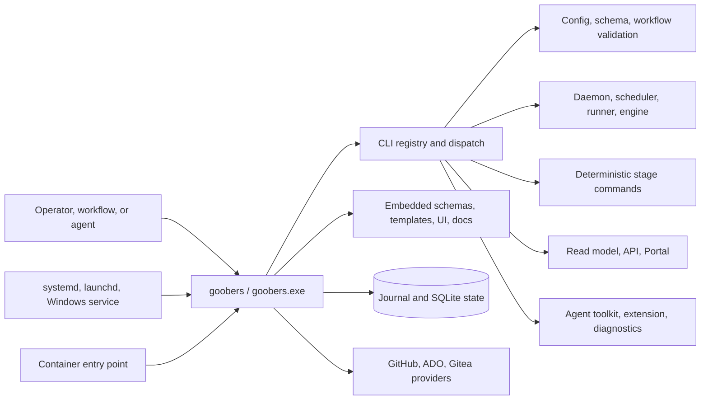
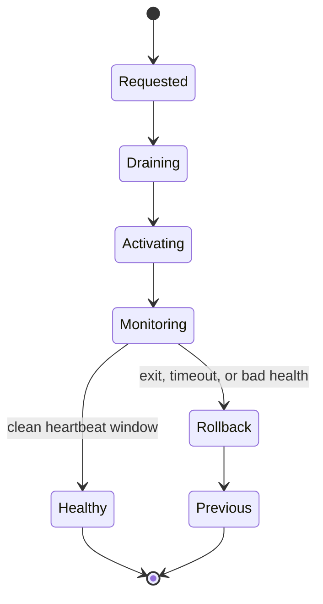

# Goobers componentization inventory

**Status:** draft — supporting inventory for
[`goobers-componentization-analysis.md`](goobers-componentization-analysis.md).

This inventory separates source packages, runtime responsibilities, deployable
artifacts, and embedded resources. Those are different kinds of modularity:
Goobers already has many Go packages, but its primary local runtime and public
command surface are linked into one executable.

## 1. Current deployable shape



Other binaries exist (`operator`, `config-sync`, release/test tools), but the
local product contract is centered on `goobers`.

## 2. Boundary inventory

| Boundary | Current ownership | Coupling | Patch value | First-split suitability |
| --- | --- | --- | --- | --- |
| Public CLI and dispatch | `cmd/goobers` | Every command, help, exit code, output | Low by itself; must remain stable | **Keep in core** |
| Config/schema validation | `api/schemas`, `api/validate`, `internal/instance`, workflow interpreters | Startup, `validate`, authoring, recovery, update smoke check | Medium | Source extraction first; keep core fallback |
| Local daemon composition | `cmd/goobers`, `internal/localscheduler`, runner wiring | Credentials, worktrees, telemetry, journal, providers | High operational risk | **Do not split first** |
| Runner and workflow engine | `internal/runner`, `internal/engine` | Broad dependency closure, durable semantics | Potentially high, but compatibility-critical | **Do not split first** |
| Deterministic built-in stage commands | many `cmd/goobers` files plus provider/domain packages | Existing argv/env/result-file subprocess contract | High: frequent workflow blockers can be patched | **Best first helper candidate** |
| Read model and HTTP API | `internal/readmodel`, `readservice`, `httpapi` | Journal/SQLite consistency, auth, live daemon | Medium | Later, only if scale evidence requires |
| Portal static files | `internal/portalassets`, `portal/` | `fs.FS`, exact API compatibility | High UI patch value; low runtime coupling | **Best first external resource** |
| Agent toolkit | root embedded FS plus `internal/agentkit` | Release-matched source and drift manifest | Medium/high content patch value | Good resource-pack candidate |
| Portal extension | root embedded FS plus `internal/portalextension` | Release/commit-stamped bundle | Medium/high content patch value | Good resource-pack candidate |
| Onboarding/templates/examples | several small embedded FS values | Offline first-run and deterministic output | Low patch urgency | Keep embedded initially |
| Service definitions | `packaging.ServiceFiles` | install-time template substitution | Low | Keep embedded |
| Self-update and recovery | `internal/selfupdate`, service supervisor | Current/previous binary transaction and heartbeat rollback | Foundation for patching | **Extend, never bypass** |
| Kubernetes operator/config sync | existing separate commands | Tier-3 deployment contracts | Already separate | Preserve current quarantine/layout |

## 3. Compatibility surfaces that cannot change

### Public invocation

- Executable remains `goobers` / `goobers.exe`.
- Existing command names, aliases, flags, help, stdout/stderr, structured JSON,
  and exit codes remain stable.
- `GOOBERS_BIN` continues to identify the public front executable.
- Services and containers continue to invoke the public front executable.

### Gaggle workflow invocation

Existing YAML commonly declares:

```yaml
run:
  command: [goobers, backlog-query, --claim]
```

The workflow must not name, locate, version, or understand a helper. Delegation
is an implementation detail of the front executable.

### Stage process protocol

The current shell executor creates an implicit protocol:

| Channel | Existing contract |
| --- | --- |
| Arguments | Existing command argv and flags |
| Identity | `GOOBERS_RUN_ID`, instance, gaggle, workflow, task, goober |
| Config pin | applied config digest and config-generation directory |
| Repository | provider, base URL, owner, project, name, base branch |
| Credentials | capability-scoped `GOOBERS_CRED_*` variables |
| Additional repositories | `GOOBERS_ADDITIONAL_REPO_*` paths |
| Input values | `GOOBERS_INPUT_*` variables |
| Typed errors | executor-owned built-in error file |
| Typed outputs | explicit or implicit result file |
| Evidence | bounded stdout/stderr and result-file artifact |
| Telemetry/journal | scoped journal plane endpoint and token |
| Completion | process exit status |

A helper boundary should reuse this shape for stage commands rather than invent
a second gaggle-facing protocol.

### Durable and wire contracts

Component changes cannot silently alter:

- journal event types or projection semantics;
- result, invocation, verdict, artifact, and diagnostics schemas;
- provider-stage result filenames and required outputs;
- workflow interpreter behavior;
- config-generation fencing;
- release/feature compatibility claims;
- update health and rollback semantics.

## 4. Embedded resource classification

### Class A: core contracts — embed

| Resource | Why |
| --- | --- |
| JSON Schemas | Validation and explain/schema commands must be self-consistent with the running code and work during recovery/offline operation. |
| Field-purpose metadata | Loaded at package initialization; mismatch can corrupt guidance or panic startup. |
| Minimal instance templates | `init` must remain available from a bare binary and templates are tiny. |
| Scaffold templates | Small, offline, and coupled to generated config shape. |
| Service definitions | Small and needed to repair/install supervision from the executable. |

External copies may be published for inspection, but the core should retain a
release-matched embedded authority.

### Class B: core fallback plus optional signed override

| Resource | Why |
| --- | --- |
| Portal | Existing `fs.FS` seam and separate release archive make externalization straightforward; an embedded minimal/full fallback preserves recovery and one-file installs. |
| Agent toolkit | Content changes more often than execution semantics and already has version/commit manifests; exact release matching still matters. |
| Portal extension | Narrow builder seam and content-heavy payload; suitable for a separately activated bundle. |
| Canonical examples | Useful to patch authoring guidance, but existing examples must remain available offline. |

An override must be explicitly activated from a verified version directory.
No current-working-directory, adjacent-unversioned-file, or `PATH` fallback is
acceptable.

### Class C: keep embedded

| Resource | Why |
| --- | --- |
| Quickstart/tutorial sample | Tiny and central to first-run reliability. |
| Time zone database | Standard-library runtime behavior must not depend on a mutable side file. |

### Class D: release-only external assets

Onboarding archives, release notes, feature snapshots, Portal archives, and
agent-toolkit archives may continue to exist as release artifacts. Their
presence does not mean the executable should trust an arbitrary extracted copy
at runtime.

## 5. Safe resource-pack shape

Recommended conceptual layout:

```text
components/
  active.json
  sets/
    <set-id>/
      manifest.json
      helpers/
        goobers-stage[.exe]
      assets/
        portal/
        agent-toolkit/
        portal-extension/
```

`manifest.json` should contain:

- schema version;
- immutable set ID;
- product version and commit provenance;
- minimum/maximum compatible core protocol;
- OS/architecture;
- each file's relative path, size, SHA-256, type, and executable bit;
- helper protocol versions and supported command families;
- asset contract versions, including Portal API contract identity;
- signature/provenance reference;
- health/smoke checks.

`active.json` should name one immutable set, be written atomically, and contain
no arbitrary path. The previous active set remains retained for rollback.

## 6. Discovery and filesystem rules

Component discovery must:

1. start from a configured/supervised component root, not `PATH`;
2. clean and validate every relative path;
3. reject symlinks, junction/reparse escapes, non-regular executable files, and
   unexpected writable parents;
4. verify manifest authenticity and every file digest before activation;
5. open safely enough that the verified object cannot be swapped before use;
6. refuse incompatible OS/architecture or protocol ranges;
7. never scan for “nearest” helpers or load from the current directory;
8. record the selected set ID and component digest in diagnostics/journal
   provenance without exposing secrets.

The repository already contains `durability`, `safeopen`, `secfile`, and atomic
journal-write primitives that should be evaluated for reuse.

## 7. Process-boundary candidates

### Candidate 1: deterministic stage helper

Private executable name for illustration: `goobers-stage`.

Front behavior:

```text
goobers backlog-query ... 
  -> registry classifies command as delegated
  -> validates active component set
  -> launches exact helper path
  -> forwards argv, scoped environment, stdio, and signals
  -> returns helper exit code unchanged
```

Why it is attractive:

- workflows already invoke these commands as subprocesses;
- the front executable can preserve the complete CLI;
- provider-stage result files and typed errors already define machine exchange;
- helper crashes do not corrupt the daemon process;
- a blocked provider or PR-lifecycle command can be patched without replacing
  the scheduler/engine core;
- the command family is a large part of `cmd/goobers`.

Required source work before extraction:

- move handlers out of package `main` into importable command-family packages;
- centralize flag/help/output contracts so front and helper cannot drift;
- separate command-specific dependencies from daemon composition;
- add golden conformance tests that run in-process and delegated forms.

### Candidate 2: authoring/validation helper

This boundary has a smaller closure than the full executable and could speed
authoring-focused tests. It should not be the first hot-patch dependency:
validation is required for update smoke checks, startup safety, and recovery.

A future helper must retain an embedded core validator fallback and refuse any
helper whose schema/workflow contract identity differs from the core.

### Candidate 3: Portal/resource pack

This is the lowest-risk deploy-time experiment:

- no new public CLI;
- existing `fs.FS` abstraction;
- existing separately packaged Portal artifact;
- easy byte/digest comparison;
- failure can fall back to embedded assets.

It tests signed manifest, activation, diagnostics, and rollback machinery
without moving execution semantics.

### Candidate 4: read service worker

Potential benefit exists for independent Portal/API patching, but a long-lived
worker adds lifecycle, authentication, cancellation, journal consistency,
upgrade draining, port/socket ownership, and support burden. Defer until
measurements show read-model/API tests or faults require process isolation.

### Candidate 5: engine/runner worker

Reject as an initial boundary. It has the broadest compatibility obligations,
near-monolithic dependency closures, in-memory composition, credential and
worktree ownership, and durable state-machine semantics.

## 8. Component health and rollback inventory

The current update supervisor supplies a good state machine to generalize:



A component-set activation should use the same principles:

- stage complete immutable set;
- validate manifest and signatures;
- run static smoke checks before activation;
- drain affected long-lived consumers when needed;
- atomically switch one pointer;
- run health/conformance probes;
- restore the previous pointer as one operation;
- retain enough evidence to explain the rollback.

Per-file hot replacement inside an active directory is explicitly excluded.

## 9. CI ownership inventory

Recommended source/test ownership units:

| Unit | Contents | Validation |
| --- | --- | --- |
| `internal/cli/contract` | command descriptors, aliases, help, exit/output metadata | registry/man-page parity |
| `internal/commands/core` | version, init, validate fallback, service/update/recovery | cross-platform core tests |
| `internal/commands/stage/...` | deterministic stage families | package-local unit tests plus stage protocol conformance |
| `internal/commands/read` | status, trace, cost, work items, read operations | read-model/API fixtures |
| `internal/commands/authoring` | schema, explain, features, scaffold, examples | schema and golden output tests |
| `internal/componentset` | manifest, verification, activation, rollback | filesystem attack and crash-recovery tests |

The names are illustrative. The important change is moving tests out of one
package-main ownership boundary while preserving one registry and one CLI.
